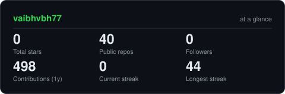
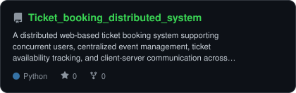

<div align="center">

<!-- PORTRAIT - generated by scripts/dotify.py from me.jpeg.
     Colour mode, so one file serves both GitHub themes. Regenerate with:
       python3 scripts/dotify.py me.jpeg -o assets/portrait \
         --cols 100 --equalize --detail 0.5 --color -->


<br>

<!-- NAME / TAGLINE - animated typing -->
<a href="https://github.com/vaibhvbh77">
  
</a>

<br>

<!-- SOCIALS -->
<a href="https://www.linkedin.com/in/vaibhav-bhatnagar-41b9131a9/"></a>
<a href="mailto:vaibhavbh77@gmail.com"></a>
<a href="https://leetcode.com/u/n0face/"></a>


</div>

---

## `~/` whoami

```console
$ cat about.txt
```

Hi, I'm **Vaibhav Bhatnagar**. I enjoy building systems that involve
distributed computing, networking, and problem solving, and I like understanding
what happens under the hood when multiple components have to work together.

- Currently exploring **distributed systems, backend engineering, and system design**
- Building with **Java, Spring Boot, Docker, and Python**
- Working with **distributed coordination, concurrency, networking, and fault tolerance**
- Solving **DSA problems** consistently and strengthening my problem-solving fundamentals

<br>

<div align="center">

## `~/` toolbox


</div>

---

<div align="center">

## `~/` skill radar

<table>
<tr>
<td width="50%" align="center" valign="middle">

<!-- Self-rated radar - edit assets/skills.json, the workflow redraws it -->
<picture>
  <source media="(prefers-color-scheme: dark)" srcset="assets/radar-dark.svg">
  <source media="(prefers-color-scheme: light)" srcset="assets/radar-light.svg">
  
</picture>

</td>
<td width="50%" align="center" valign="middle">

<!-- Live radar built from real language byte counts across your repos -->
<picture>
  <source media="(prefers-color-scheme: dark)" srcset="assets/radar-langs-dark.svg">
  <source media="(prefers-color-scheme: light)" srcset="assets/radar-langs-light.svg">
  
</picture>

</td>
</tr>
</table>

</div>

---

<div align="center">

## `~/` contribution calendar

<!-- 3D isometric calendar, regenerated every 6h by .github/workflows/metrics.yml -->


<br><br>

<!-- Snake eats the contribution graph - .github/workflows/snake.yml -->
<picture>
  <source media="(prefers-color-scheme: dark)" srcset="https://raw.githubusercontent.com/vaibhvbh77/vaibhvbh77/output/snake-dark.svg">
  <source media="(prefers-color-scheme: light)" srcset="https://raw.githubusercontent.com/vaibhvbh77/vaibhvbh77/output/snake.svg">
  
</picture>

</div>

---

<div align="center">

## `~/` the numbers

<!-- Generated by scripts/cards.py into this repo. Deliberately NOT
     github-readme-stats / streak-stats / github-profile-trophy: those are
     shared public instances that go down and take the whole section with them. -->
<picture>
  <source media="(prefers-color-scheme: dark)" srcset="assets/card-stats-dark.svg">
  <source media="(prefers-color-scheme: light)" srcset="assets/card-stats-light.svg">
  
</picture>

<br>


<br><br>


</div>

---

<div align="center">

## `~/` selected work

<!-- Cards generated by scripts/cards.py from assets/projects.json.
     GitHub-hosted projects use live repository cards.
     The network monitoring project is listed separately because it is not on GitHub. -->

<table>
<tr>
<td width="50%">
  <a href="https://github.com/vaibhvbh77/Ticket_booking_distributed_system">
    <picture>
      <source media="(prefers-color-scheme: dark)" srcset="assets/card-Ticket_booking_distributed_system-dark.svg">
      <source media="(prefers-color-scheme: light)" srcset="assets/card-Ticket_booking_distributed_system-light.svg">
      
    </picture>
  </a>
</td>
<td width="50%">
  <a href="https://github.com/vaibhvbh77/SDN_Visualizer">
    <picture>
      <source media="(prefers-color-scheme: dark)" srcset="assets/card-SDN_Visualizer-dark.svg">
      <source media="(prefers-color-scheme: light)" srcset="assets/card-SDN_Visualizer-light.svg">
      
    </picture>
  </a>
</td>
</tr>
</table>

<br>

**Real-Time Network Traffic Monitoring & Anomaly Detection**

Built an end-to-end real-time network monitoring system using sampled
sFlow telemetry from a Juniper EX3400 switch, integrating **sFlow-RT,
LibreNMS, Docker, and Python** for traffic collection, analysis,
visualization, and alerting.

Developed rolling-baseline detection for **DDoS and port-scanning attacks**
by analyzing per-source flow statistics, traffic rates, unique destination
ports, and deviations from historical network behavior.

<br>

| project | link | stack |
|---|---|---|
| **[Distributed Ticket Booking System](https://github.com/vaibhvbh77/Ticket_booking_distributed_system)** | [GitHub](https://github.com/vaibhvbh77/Ticket_booking_distributed_system) | `Java` `Distributed Systems` `Concurrency` |
| **[SDN Visualizer](https://github.com/vaibhvbh77/SDN_Visualizer)** | [GitHub](https://github.com/vaibhvbh77/SDN_Visualizer) | `Networking` `SDN` `Visualization` |
| **Real-Time Network Traffic Monitoring & Anomaly Detection** | — | `sFlow` `sFlow-RT` `Python` `Docker` `LibreNMS` |

</div>

---

<div align="center">

<sub>`01110100 01101000 01100001 01101110 01101101 01110011 00100000 01100110 01101111 01110010 00100000 01110011 01100011 01110010 01101111 01101100 01101100 01101001 01101110 01100111`</sub>

</div>
